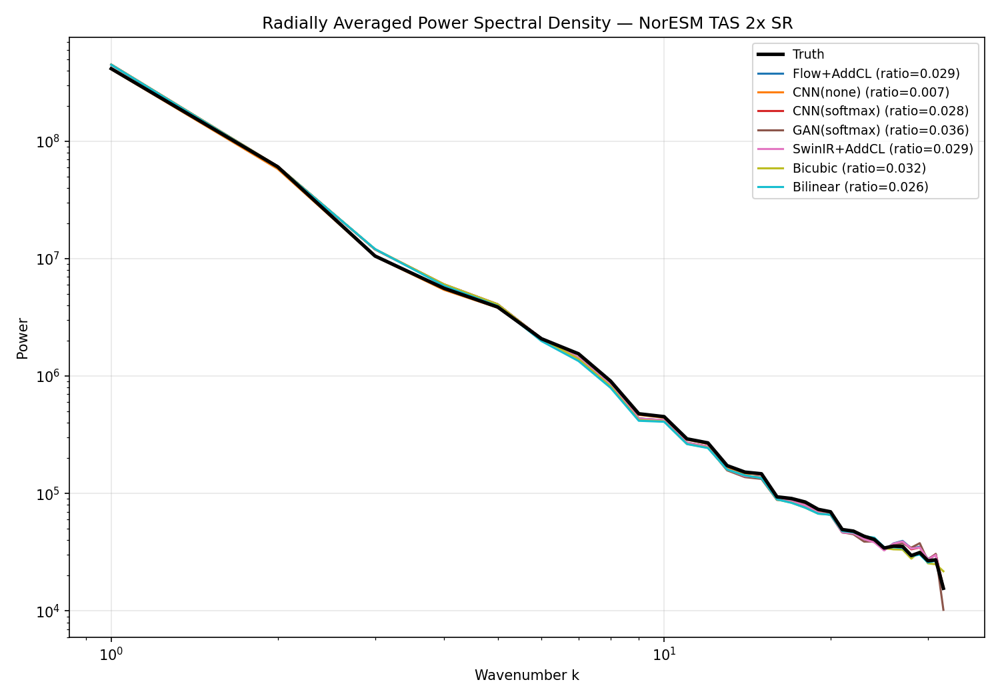
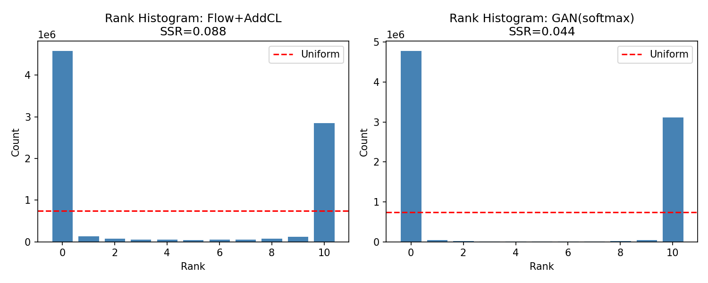
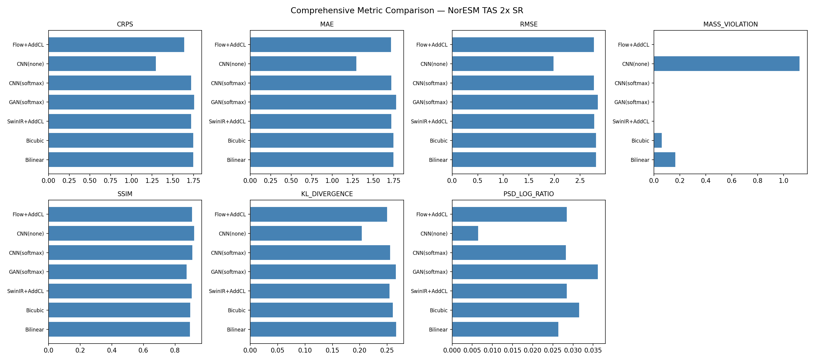

# Comprehensive Evaluation Report: NorESM TAS 2x Super-Resolution

**Date**: 2026-05-11
**Commit**: (metrics branch)
**Dataset**: NorESM TAS 2x SR, 2000 test samples (of ~12K total)
**Ensemble size**: 10 members (flow matching, GAN)
**ODE solver**: midpoint, 10 steps

## Models Evaluated

| Model | Type | Constraint | Parameters |
|-------|------|-----------|------------|
| Flow+AddCL | Flow matching (wide96) | Additive correction | ~113M |
| CNN(none) | Harder et al. ResNet | None | ~100K |
| CNN(softmax) | Harder et al. ResNet | Softmax | ~100K |
| GAN(softmax) | Harder et al. ResNet+noise | Softmax | ~200K |
| SwinIR+AddCL | SwinIR-M finetuned (1ch) | Additive correction | ~11.7M |
| Bicubic | Interpolation baseline | None | 0 |
| Bilinear | Interpolation baseline | None | 0 |

## Results

| Model | CRPS | MAE | RMSE | MassViol | SSIM | KL | PSD-LR | SSR |
|-------|------|-----|------|----------|------|-----|--------|-----|
| Flow+AddCL | 1.6414 | 1.7196 | 2.7741 | 0.0000 | 0.9101 | 0.2507 | 0.0286 | 0.088 |
| CNN(none) | **1.2976** | **1.2976** | **1.9840** | 1.1264 | **0.9231** | **0.2045** | **0.0065** | -- |
| CNN(softmax) | 1.7232 | 1.7232 | 2.7782 | 0.0000 | 0.9113 | 0.2558 | 0.0283 | -- |
| GAN(softmax) | 1.7617 | 1.7817 | 2.8512 | 0.0000 | 0.8750 | 0.2667 | 0.0362 | 0.044 |
| SwinIR+AddCL | 1.7252 | 1.7252 | 2.7806 | 0.0000 | 0.9082 | 0.2550 | 0.0285 | -- |
| Bicubic | 1.7490 | 1.7490 | 2.8156 | 0.0626 | 0.8984 | 0.2611 | 0.0316 | -- |
| Bilinear | 1.7499 | 1.7499 | 2.8142 | 0.1665 | 0.8953 | 0.2668 | 0.0264 | -- |

**Metric definitions**: CRPS = continuous ranked probability score (lower better), MAE/RMSE in Kelvin, MassViol = |avgpool(pred) - lr_orig| in Kelvin, SSIM = structural similarity (higher better), KL = histogram KL divergence in nats (lower better), PSD-LR = mean |log10(P_pred/P_truth)| (lower better), SSR = spread-skill ratio (optimal at 1.0).

## Key Findings

### 1. CNN(none) dominates pointwise metrics but violates conservation

CNN without constraints achieves the best CRPS (1.30), MAE (1.30), RMSE (1.98), SSIM (0.92), KL (0.20), and PSD match (0.007). However, its mass violation is 1.13 K -- it does not conserve the large-scale field. This is because NorESM LR and HR come from different simulation runs, so the unconstrained model exploits this by learning the HR distribution directly without being forced through the LR bottleneck.

### 2. Constraints hurt pointwise metrics on NorESM

Adding the softmax constraint to CNN degrades CRPS from 1.30 to 1.72 -- a 33% increase. Similarly, all constrained models (CNN-softmax, GAN-softmax, Flow+AddCL, SwinIR+AddCL) cluster at CRPS ~1.64-1.76, barely beating baselines (1.75). The conservation constraint is actively harmful on this dataset because LR and HR are not from the same simulation. The constraint forces the model to match a LR field that is only approximately related to the HR target.

### 3. Both ensemble models are severely underdispersive

**This is the most important finding.** Rank histograms show extreme U-shapes for both Flow+AddCL and GAN(softmax):
- Flow+AddCL: SSR = 0.088 (spread ~8.8% of what calibration requires)
- GAN(softmax): SSR = 0.044 (spread ~4.4% of what calibration requires)

The truth falls outside the ensemble range at the vast majority of spatial points. The ensemble members are near-copies of each other, providing no meaningful uncertainty quantification. This is consistent with the known issue of mode collapse in GANs and insufficient stochasticity in flow matching with few ODE steps.

### 4. All models preserve spectral structure well

PSD log-ratio is below 0.04 for all models, indicating that 2x SR is spectrally easy -- the models are not smoothing away fine-scale structure. CNN(none) achieves near-perfect spectral match (0.007). Even bilinear interpolation has reasonable PSD (0.026).

### 5. Learned models provide marginal improvement over baselines

Among constrained models, the improvement over bicubic interpolation is modest:
- Best constrained CRPS: 1.64 (Flow+AddCL) vs 1.75 (Bicubic) = 6% improvement
- Best constrained SSIM: 0.91 (CNN-softmax) vs 0.90 (Bicubic) = 1% improvement

The 2x SR task on smooth temperature fields does not strongly differentiate between methods.

## Diagnostic Plots

### Power Spectral Density

All models track the truth PSD closely. CNN(none) is essentially on top of truth. GAN shows slightly more deviation at the highest wavenumbers.

### Rank Histograms

Classic U-shape indicating severe underdispersion. Counts pile up at rank 0 (truth < all members) and rank M (truth > all members), with very few in the interior.

### Metrics Summary

## Reproducibility

- Script: `src/downscaling/evaluation/comprehensive.py`
- Run: `python -m downscaling.evaluation.comprehensive --max-samples 2000`
- All model checkpoints in `pool/datasets/noresm-dataset/models/`
- Results JSON: `src/downscaling/evaluation/results/comprehensive_results.json`
